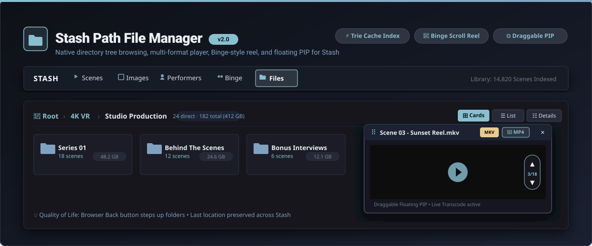
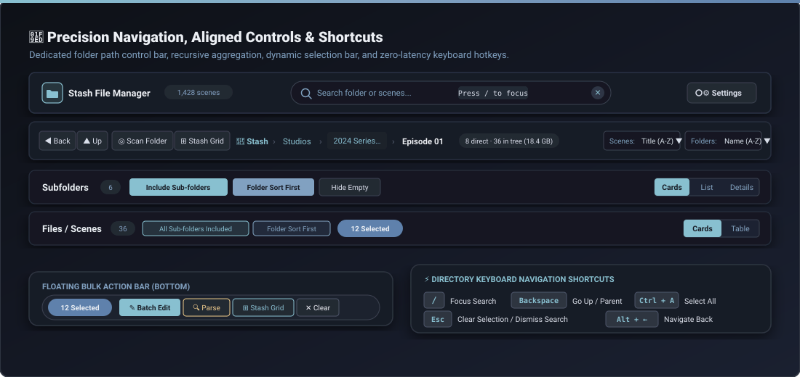

# Stash Path File Manager



A high-performance, path-based directory navigation plugin for [Stash](https://github.com/stashapp/stash), featuring customizable folder views, Binge-style directory reel playback, a floating draggable Picture-in-Picture (PIP) player, recursive subfolder aggregation with folder-first sorting, live regex filename metadata parsing, and desktop keyboard shortcuts.

---

## 🎯 Design Philosophy

Every architectural and visual decision in **Stash Path File Manager** is guided by five core tenets:

1. **Zero Dead Clicks & Flow Continuity:** Navigation should never force redundant intermediate clicks through empty parent directories. Whether traversing deep folder trees via smart root detection or collapsing single-child path hallways, every click should immediately reveal actionable media content.
2. **High Information Density with Visual Elegance:** Eliminate wasted whitespace, bulky padding, and oversized cards. Provide flexible, compact layouts—from dynamic zoom sliders supporting up to 10 scene cards per row to fluid CSS Grid folder chips and space-efficient data tables.
3. **Design Uniformity & Vector Iconography:** Maintain a clean, professional aesthetic across every component. Replace disparate emojis and mismatched unicode artifacts with cohesive monochrome vector SVGs, standardized pill badges, and consistent Title Case nomenclature (`Batch Edit`, `Stash Grid`, `Cards`, `Table`, `Details`).
4. **Instant Client-Side Responsiveness & Resilient Caching:** Browsing your media library should feel instantaneous. By constructing an in-memory Path Trie paired with multi-tier storage (`sessionStorage` and IndexedDB), folder hierarchy transitions and scene filtering execute with zero network round-trip delay.
5. **Keyboard-First Power Ergonomics:** Offer effortless, fluid navigation for desktop power users. Dedicated single-key shortcuts (`/`, `Backspace`, `Ctrl+A`, `Esc`) complement touch swipes and mouse wheel inertia physics, creating a frictionless workflow.

---

## 📸 Feature Showcase

### 1. 📁 3 Customizable Folder Navigation Views


Eliminate wasted vertical space with compact folder layouts tailored to any library structure:
* **Cards Grid:** Sleek, compact tiles showing the folder icon, folder name, scene count badge, and formatted file size. Includes a smooth thumbnail zoom slider (120px–300px) with persistent layout calculation.
* **Compact List:** Ultra space-efficient horizontal folder chips showing the icon, bold name, and item count. Includes an adjustable box width slider (140px–420px) allowing dynamic CSS Grid recalculation to fit 30+ directories comfortably on a single screen.
* **Detail Table:** Classic file manager data table with sortable columns for **Name**, **Type**, **Scenes**, **Size**, and quick actions (**Stash Grid** to open in Stash's native scene grid, and **Scan Folder** to trigger a filesystem metadata scan).
* **View Persistence:** Your selected view preference and zoom settings are saved automatically in `localStorage` across sessions.

---

### 2. 🧭 Precision Navigation, Aligned Controls & Power Shortcuts


* **Dedicated Folder Navigation Control Line:** Positioned directly above subfolders, this unified control bar houses:
  * **History Navigation:** Dedicated `◀ Back` and `▲ Up` buttons for rapid directory hopping with browser history synchronization.
  * **Fast Action Triggers:** Quick `Scan Folder` (triggers Stash filesystem metadata scan) and `Stash Grid` (opens the current directory in Stash's native grid in a new tab).
  * **Responsive Breadcrumb Truncation:** Deep folder paths gracefully truncate intermediate segments with `text-overflow: ellipsis` on narrower viewports, preserving layout integrity while revealing the full path on hover tooltip.
  * **Folder Tree Metrics Badge:** Live pill badge displaying both direct scene count and recursive tree count with total disk space (`8 direct · 36 in tree (18.4 GB)`).
  * **Contextual Actions:** Immediate access to `Parse` (Regex Filename Parser) and `Batch Edit`.
  * **Dual Sorting Controls:** Independent dropdown selectors for **Scenes** (Title, Date, Duration, Size, Rating) and **Folders** (Name, Scene Count).
* **Aligned Subfolder & Scene Controls:**
  * **Include Sub-folders:** Recursively aggregates scenes across all descendant directories into the current view.
  * **Folder Sort First:** Groups and orders recursive scenes by parent folder sorting rule first, then applies scene sorting within each folder.
  * **Hide Empty:** Instantly toggles visibility of empty directories without scenes.
* **Dynamic Selection & Floating Bulk Action Bar:**
  * **Unified Header Button:** A dynamic control that switches between `Select All` and `[N] Selected`—clicking clears active selections instantly.
  * **Floating Bottom Bar:** A persistent bottom pill displaying the active count button and vector-icon buttons for `Batch Edit`, `Parse`, `Stash Grid`, and `Clear`.
* **Directory Keyboard Shortcuts:**
  * <kbd>/</kbd> — Instantly focus the live search box.
  * <kbd>Backspace</kbd> or <kbd>Alt</kbd> + <kbd>←</kbd> — Go up to parent folder or back in history.
  * <kbd>Ctrl</kbd> + <kbd>A</kbd> / <kbd>Cmd</kbd> + <kbd>A</kbd> — Select all visible scenes in the current folder.
  * <kbd>Esc</kbd> — Clear scene selection or dismiss live search.
* **Circular Vector Search Clear Button:** The search input features a sleek circular hover button with an inline SVG cross for instant query reset.

---

### 3. 🎬 Multi-Format Video Player & Binge-Style Reel Navigation


* **Multi-Format Playback & Stream Selection:** Direct stream integration with Stash API key authentication, automatic error fallback to live transcode (MP4/WebM/HLS), custom stream profile selector, and instant Stash Player link for unsupported proprietary codecs.
* **Smart Codec Inspection:** Inspects stream metadata (`video_codec`); MPEG-4 Part 2 / ASP (`mpeg4`, `divx`, `xvid`) in `.mp4` containers automatically streams via adaptive HLS, while `h264.mp4` streams directly without transcode overhead.
* **📱 Binge-Style Directory Reel:**
  * **5-Slide Window Buffer:** Pre-buffers adjacent video streams and unblurred full-bleed posters with zero split-second loading flash.
  * **Inertia Physics & 50% Threshold:** Smooth dragging and wheel scrolling with a true 50% screen height threshold; minor pulls snap smoothly back to center while intentional flicks slide cleanly to adjacent scenes.
  * **Keyboard & Touch Controls:** `↓` / `PageDown` / `J` (Next), `↑` / `PageUp` / `K` (Previous), `Space` (Play/Pause), `←` / `→` (±10s seek), `M` (Mute), `F` (Fullscreen), `P` (PiP), `Escape` (Close).
  * **TikTok / Instagram-Style Overlay:** Metadata overlay auto-hides after 2.5 seconds of inactivity alongside custom dark scrubber and audio controls.

---

### 4. ⧉ Draggable Floating Picture-in-Picture (PIP) Window
* **Float Anywhere:** Click the `⧉ Float PIP` button to pop the video out into a floating mini-player.
* **Draggable Header:** Grab the drag handle (`⠿`) to position the window anywhere across the screen.
* **Full Background Interactivity:** Continue navigating directories, searching files, and batch editing while the video plays uninterrupted.
* **In-PIP Controls:** Quick buttons for previous/next scene (`▲` / `▼`), stream switcher, restore to modal (`🗖`), and close (`×`). Video playback timestamp is preserved across modal and PIP transitions with zero audio desync.

---

### 5. ⚡ In-Memory Trie Cache, Filename Regex Parser & Stash Tasks
* **Progressive Indexing & Multi-Tier Caching:** Builds a client-side Path Trie stored in memory, session storage, and IndexedDB for instant folder switching and zero-latency filtering.
* **Folder-Scoped Filename Regex Parser:** Test regular expression pattern schemes scoped strictly to the current folder with live interactive match preview tables.
* **Native Stash Plugin Tasks (`sfm_tasks.py`):**
  * `Rescan Library and Rebuild Tree`: Crawls library directories and rebuilds the directory cache.
  * `Reset Plugin Settings to Defaults`: Restores factory settings via GraphQL mutation.
  * `Initialize Plugin Configuration`: Verifies library paths and seeds configuration into Stash.
* **In-App Settings & Tasks Dialog:** Accessible directly via the header `⚙ Settings` button, allowing you to configure playback streams, root paths, default view modes, and task execution.

---

## 🗺️ Roadmap & Architectural Evolution

### 📍 Phase 1: Core Navigation & Player Foundation (Completed — v1.0.0 to v2.4.0)
- [x] **In-Memory Path Trie Data Structure:** Client-side hierarchical trie providing $O(1)$ directory resolution and instant branch traversals. *(v1.0.0 — 2026-09-20)*
- [x] **Multi-Tier Cache Pipeline:** Hierarchical caching across RAM, `sessionStorage`, and IndexedDB persistence. *(v1.0.0 — 2026-09-20)*
- [x] **Folder-Scoped Filename Regex Parser:** Real-time regex pattern testing with live tabular preview of parsed scene metadata. *(v1.0.0 — 2026-09-20)*
- [x] **Multi-Scene Selection & Floating Bulk Bar:** Batch selection engine with bulk metadata editing and native grid export. *(v1.1.0 — 2026-09-21)*
- [x] **3 Customizable Folder Views:** Compact Cards, Horizontal List Strip, and Detail Data Table. *(v2.0.0 — 2026-09-22)*
- [x] **Binge-Style Directory Reel Player:** Continuous vertical reel track with mouse wheel and touch swipe physics. *(v2.0.0 — 2026-09-22)*
- [x] **Draggable Floating PIP Window:** Persistent floating player with full background folder browsing. *(v2.0.0 — 2026-09-22)*
- [x] **Protocol-Aware Stream Engine:** Decoupled direct raw streaming from segmented HLS and progressive WebM containers. *(v2.1.1 — 2026-09-23)*
- [x] **Native Stash Plugin Settings & Backend Tasks:** Exposed settings schema and `sfm_tasks.py` backend task runner. *(v2.3.0 — 2026-09-23)*
- [x] **TikTok-Style Auto-Hiding Overlay:** Full-bleed edge-to-edge player canvas with vertical circular action bar. *(v2.4.0 — 2026-09-23)*

### 📍 Phase 2: High-Density Layouts & Interface Harmonization (Completed — v2.5.0 to v2.7.3)
- [x] **Smart Codec Inspection:** Automatic HLS transcode fallback for legacy MPEG-4 Part 2 (`mpeg4`/`divx`/`xvid`) containers. *(v2.5.0 — 2026-09-23)*
- [x] **Continuous 5-Slide Buffer Window:** Zero split-second thumbnail flash with eager poster preloading. *(v2.6.0 — 2026-09-24)*
- [x] **Recursive Subfolder Scene Aggregation:** Interactive `Include Sub-folders` toggle pulling all descendant scenes into view. *(v2.6.0 — 2026-09-24)*
- [x] **Folder-First Recursive Scene Sorting:** Group and order recursive scenes by folder sequence before applying scene sorting. *(v2.7.1 — 2026-09-24)*
- [x] **High-Density Card Sliders:** Scene card zoom slider (110px–460px, up to 10 cards per row) and folder card zoom slider. *(v2.7.0 — 2026-09-24)*
- [x] **Folder List Box-Width Slider:** Dynamic width control (140px–420px) with responsive CSS Grid recalculation. *(v2.7.0 — 2026-09-24)*
- [x] **Dedicated Folder Navigation Control Line:** Reorganized path breadcrumbs, history buttons, scan/grid triggers, and tree metrics into a unified bar directly above subfolders. *(v2.7.0 — 2026-09-24)*
- [x] **Responsive Breadcrumb Truncation:** Graceful `text-overflow: ellipsis` truncation on intermediate breadcrumb segments with full-path hover tooltips. *(v2.7.3 — 2026-09-24)*
- [x] **Standardized View Switcher Labels:** Clean, unicode-free labels across Subfolders (`Cards`, `List`, `Details`) and Scenes (`Cards`, `Table`). *(v2.7.3 — 2026-09-24)*
- [x] **Unified Selection & Floating Bar Overhaul:** Dynamic `[N] Selected` button in header and floating bar, paired with monochrome vector SVG icons (`Batch Edit`, `Parse`, `Stash Grid`, `Clear`). *(v2.7.2 - v2.7.3 — 2026-09-24)*
- [x] **Circular Vector Search Clear Button:** Tactile circular hover button with vector cross icon. *(v2.7.3 — 2026-09-24)*
- [x] **Directory Keyboard Navigation Shortcuts:** Global single-key hotkeys for `/` (search), `Backspace`/`Alt+Left` (go up), `Ctrl+A` (select all), and `Esc` (clear/dismiss). *(v2.7.3 — 2026-09-24)*

### 📍 Phase 3: Frictionless Directory Traversal & Deep Native Integration (In Progress / Next)
- [ ] **Smart Common Root Detection (Auto-Root):** Automatically detect the common filesystem base directory across all indexed scenes (e.g., `/data/` or `/data/stash/`) when no manual root override is configured, eliminating empty top-level single-folder navigation hallways. *(Design Philosophy: Zero Dead Clicks)*
- [ ] **Auto-Collapsing Single-Child Directories:** Automatically collapse or skip single-child intermediate path hallways that contain no direct scene files (GitHub-style path chaining, e.g., `Studio / 2024 /`), jumping directly to the first branching directory level. *(Design Philosophy: Zero Dead Clicks)*
- [ ] **Actionable Empty-State Guidance for Parent Folders:** When navigating into a parent directory containing subdirectories but 0 direct scene files, display a proactive inline prompt to toggle "Include Sub-folders" to immediately view all nested media. *(Design Philosophy: Flow Continuity)*
- [ ] **Transition from Overlay Layer to Native Routed View:** Re-architecting the workspace from a `position: fixed` overlay layer into an integrated page view mounted inside Stash's native main container (`/scenes?view=folder` or `/plugin/file-manager`).
- [ ] **Native Navigation Bar & Settings Retention:** Retaining Stash's top navigation bar, global search, background task queue spinners, and user settings dropdown at all times during folder browsing.
- [ ] **Theme Parity:** Seamless automatic glass and accent adaptation with community themes (e.g., Refract, Dark, Nord).

### 📍 Phase 4: Advanced Folder Metadata & Media Management (Planned)
- [ ] **Folder Poster Art & Custom Covers:** Ability to select any scene poster or custom graphic as a persistent folder thumbnail cover.
- [ ] **In-Folder Filter Parity:** Filtering items inside a specific folder by Performer, Tag, Studio, or Rating without leaving the directory hierarchy.
- [ ] **Directory Playlist Queue:** One-click queueing of entire directory trees into Stash's native playback queue or MultiView.

---

## 📋 Changelog & Development History

### [v2.9.1] — 2026-09-26 08:59:47
* **Instagram / TikTok Seamless Video Wall:** Re-architected Directory Profile into an authentic zero-border-gap 3-column video wall with edge-to-edge portrait tiles, views/duration overlay (`▶ 04:15`), resolution chips, and desktop hover card inspection.
* **Force Mobile View & Responsive Layout:** Added an interactive mobile view toggle (`IconSmartphone`) allowing one-click switching between an Instagram/TikTok mobile phone frame (430px) and a web desktop view, with full scrolling reel player integration.
* **Refined Persistent Indicators & Elevated Interface Buttons:** Harmonized browser indicators (`Sub-Folders Included/Excluded` and `Grouped by Folder / Sorted Altogether`) to match the top total file count pill style with pure high-contrast text and no leading dots; elevated all navigation and action buttons with high-contrast surfaces (`#222938`) for improved visibility.

### [v2.9.0] — 2026-09-26 05:28:54
* **Folder Profile Page & Video Wall Grid Overlay:** Implemented in-player creator-style Directory Profile view featuring folder avatar, path chip, live stats (video count, total file size, total duration, resolution breakdown), quick actions (*Play All*, *Shuffle Play*, *Stash Grid*), and a video wall grid allowing instant preview and playback of any directory scene.
* **Social Media Reel Avatar & Path Overlay:** Added interactive creator avatar pill in video metadata overlay linking directly to the Directory Profile Video Wall with pointer-events and z-index priority.
* **Non-Repeating Fisher-Yates Shuffle Queue:** Integrated a shuffle engine with right-action-rail circle toggle button (`S` hotkey), HUD status indicator, and automatic non-repeating advancement upon scene completion.

### [v2.8.2] — 2026-09-26 04:36:03
* **Floating Toolbar & Icon Standardization:** Harmonized floating batch edit and regex parse buttons to match control line styling (`btn-outline-secondary py-1 px-2`). Standardized Stash Grid button to match its icon-only counterpart (`IconGrid size={14}`). Synchronized automated packaging script for `index.yml`.

### [v2.8.1] — 2026-09-25 02:17:49
* **UI Spacing, Badge Alignment & Field Splitting:** Separated directory metrics into discrete elements with explicit margins (`99 direct · 99 in tree`). Added 1rem margin on search bar. Standardized section title box (104px label) so count badges align vertically across headers. Added 1-click interactive field splitting (`✂️ Split`) in Regex Parser.

### [v2.8.0] — 2026-09-24 20:53:48
* **Names View Mode & Header Alignment:** Added compact `Names` (filenames-only) table view mode. Standardized persistent indicators and Group by Folder naming. Overhauled regex builder with visual chunks, double-underscore release auto-detection, and path clues.

### [v2.7.3] — 2026-09-24 10:35:00
* **Standardized View Switcher Labels:** Removed inconsistent unicode glyphs (`田`, `☰`, `☷`, `⊞`), unifying both Subfolders and Files / Scenes to clean, sleek text (`Cards`, `List`, `Details` / `Cards`, `Table`).
* **Modernized Floating Bulk Action Bar:** Replaced static count badge with dynamic `[N] Selected` button (click to deselect all), and upgraded all action buttons with vector SVGs (`IconEdit`, `IconSearch`, `IconGrid`, `IconX`) and title-cased labels (`Batch Edit`, `Stash Grid`).
* **Responsive Breadcrumb Truncation:** Added `text-overflow: ellipsis` with `max-width: 160px` to intermediate path breadcrumbs and full-path hover tooltips, preventing multi-line wrapping on deep directory structures.
* **Circular Vector Search Clear Button:** Replaced plain text `×` with a circular hover button (`border-radius: 50%`) with an inline SVG cross icon.
* **Directory Keyboard Navigation Shortcuts:** Added global hotkeys for folder browsing: `/` (focus search), `Backspace` / `Alt+Left` (go up one directory), `Ctrl+A`/`Cmd+A` (select all visible scenes), and `Esc` (clear selection or dismiss search).

### [v2.7.2] — 2026-09-24 08:53:00
* **Compact SVG Sliders:** Replaced text emojis with sleek 12px SVG icons (IconZoom, IconWidth), removed bulky pill background/border, and aligned height to 24px flush with adjacent buttons.
* **Unified Select All & Count Button:** Merged Select All button and selected count badge into a single dynamic control that transforms into '[N] Selected' when scenes are selected and clears selection on click.
* **Persistent Include Sub-folders Button:** Removed checkmark prefix from Include Sub-folders button so text and button width remain completely persistent when toggled.
* **Decoupled Collapsible Titles:** Moved status badges and subfolder toggles outside the collapsible header wrappers to prevent accidental section collapsing.
* **Aligned Subfolder Controls & Indicators:** Positioned 'Folder Sort First' immediately after 'Include Sub-folders' with matching button styling, and matched exact widths (176px / 132px) and height (24px) to their corresponding indicators below.
* **Relocated Sorting Dropdowns:** Moved both Scenes and Folders sorting dropdowns into the right-hand padding of the current path navigation line.

### [v2.7.1] — 2026-09-24 07:45:00
* **Folder-First Recursive Scene Sorting:** When **Include Sub-folders** is enabled, scenes can now be sorted under their parent folder's sorting rule first, then sorted by the chosen scene sort criteria within each folder.
* **Persistent 'Folder Sort First' Toggle:** Added an interactive toggle in the sort toolbar (`sortByFolderFirst`, default: `true`, persisted in `localStorage`) enabling quick switching between folder-first grouping and global flat sorting.
* **Header Mode Indicator:** Added a `Folder Sort First` pill badge to the Files / Scenes section header when recursive folder-first sorting is active.
* **Contextual Folder Path Chips:** Added subtle relative folder path tags to Scene cards and Table rows when viewing scenes with subfolders included.

### [v2.7.0] — 2026-09-24 06:05:00
* **Binge Reel Parameters & Direct Physics:** Replaced debounced multi-frame translation with Binge's instant-response delta threshold logic. Micro-movements (<28px) are filtered, fast single wipes/flicks (>200px) cleanly advance 2 videos, and normal scroll motions immediately fire smooth slide transitions.
* **Folder List Mode Box-Length Slider:** Added a length/width slider (140px–420px) to the folder mode list view, allowing dynamic adjustment of fixed box lengths and automatic recalculation of columns per row via CSS Grid.
* **10 Scenes Per Row in Scenes View:** Widened the scene card size slider range down to 110px and up to 460px (previously 160px–420px), accommodating up to 10 scene cards per row on standard desktop viewports.
* **Unified Interface Styling & Layout Reorganization:**
  * Redesigned **[Include Sub-folders]** as an action button styled identically to **[Select All]** in the scenes view.
  * Relocated the entire folder navigation control line (**[◀ Back]**, **[▲ Up]**, **Root**, and path breadcrumbs) to sit directly above the **Subfolders** title.
  * Harmonized count badges across the page into consistent dark rounded pill badges.
  * Standardized title casing across all UI labels and buttons.

### [v2.6.0] — 2026-09-24 04:35:00
* **Binge-Style Fluid Multi-Video Scrolling & Swiping:** Upgraded the vertical reel track to a 5-slide continuous sliding window (`Slide -2` to `Slide +2`) with unified touch and wheel inertia physics. Users can swipe past 1 video directly to the second in a single continuous wipe or rapid wheel flick without abrupt snap-backs.
* **Zero Split-Second Thumbnail Flash:** Removed the forced `poster` attribute from the active `<video>` element and deferred background poster rendering to a 350ms graceful fallback. Fast-loading and pre-buffered video streams begin playback directly with uninterrupted video frame rendering.
* **Sub-folder Scene Recursion ('include sub-folders' Toggle):** Added an interactive toggle next to the Subfolders section header titled `include sub-folders`. When enabled, scenes across all descendant sub-folders in the current directory (all levels down) are recursively aggregated into the current view, updating the scene grid/table, selection counters, batch operations, and the Binge reel playback feed.

### [v2.5.5] — 2026-09-24 03:25:00
* **Fix `Cannot access 'streamMode' before initialization` ReferenceError:** Resolved temporal dead zone (TDZ) order error in `BingeReelPlayerModal` where adjacent stream resolution hooks evaluated before the `streamMode` state hook was initialized.

### [v2.5.4] — 2026-09-24 01:25:00
* **Restored Divider Above PiP & Precision Scrubber Alignment:** Restored the action divider above the PiP button. Moved PiP and Fullscreen to the bottom of the right rail so Fullscreen sits directly above the scrubbing line.
* **Balanced Action Rail Spacing:** Standardized even spacing (8px) between buttons and doubled the vertical clearance (16px) around the two dividers framing the Previous/Next video navigation group.
* **Hardware Codec Chip Icon:** Replaced the lightning icon with a clean vector microchip/codec processor icon for the stream transcode selector.
* **Complete Monochrome SVG Overlays:** Converted all remaining player emojis and text glyphs to sleek dark-themed vector SVGs.
* **Binge Discover-Style Video Preloading:** Adopted Binge's multi-slide buffer architecture. Adjacent slides render unblurred full-bleed posters with pre-buffered `<video preload="auto" muted />` pipelines, plus background metadata prefetching (+2 ahead), delivering instant 60fps scrolling playback with zero buffering delay.

### [v2.5.3] — 2026-09-24 00:35:00
* **Consolidated Stash Plugin Settings:** Streamlined `stash_file_manager.yml` to the 5 core settings with concise single-line descriptions, resolving visual clutter in Stash's native settings panel.
* **Proactive MPEG-4 (.mp4) Fallback:** Enhanced detection checking `video_codec`, `format`, path/filename keywords, GraphQL metadata, and an active video track frame watchdog. MPEG-4 Part 2 / ASP (`mpeg4`, `divx`, `xvid`) in `.mp4` containers automatically streams via HLS.
* **Elevated Metadata Description Overlay:** Moved the file type badge from behind the scene title down to the second line alongside codec, video duration, file size, and date.
* **Monochrome Vector SVG Icons:** Replaced colorful emojis with clean, dark-themed monochrome vector SVG icons for all action buttons (Stash, VLC, Copy, Transcode, Navigation, PiP, Fullscreen).

### [v2.5.0] — 2026-09-23 12:15:00
* **MPEG-4 (.mp4) vs H.264 (.mp4) Smart Codec Detection:** Added codec-level inspection querying `video_codec`. MPEG-4 Part 2 / ASP (`mpeg4`, `mp4v`, `divx`, `xvid`) in `.mp4` containers automatically defaults to HLS transcode, while `h264.mp4` streams directly.
* **PiP Redesign — Zero Lingering Player with Seamless Enlarge:** Switching to PiP completely dismisses the player modal dialog and backdrop so users can browse Stash with no lingering placeholder card. Restores smoothly from floating pill or native PiP window.
* **Synchronized Native Stash Plugin Settings:** In-app settings now write directly to and read from Stash's native `config.yml` (`configuration.plugins.stash_file_manager`).

### [v2.4.0] — 2026-09-23 10:45:00
* **Unified Right-Side Circular Action Bar:** Moved all player function buttons into circular action buttons aligned vertically on the right.
* **TikTok / Instagram-Style Auto-Hiding Metadata Overlay:** Relocated file name, format badge, and studio pill to the bottom-left overlay, with duration, file size, date, and video codec directly beneath.
* **Full-Bleed Canvas & Removed Bars:** Completely eliminated static top and bottom bars, transforming the player into an edge-to-edge video canvas.

### [v2.3.0] — 2026-09-23 09:12:00
* **Native Stash Plugin Settings & Tasks:** Introduced `sfm_tasks.py` backend runner implementing standard Stash task operations (`Rescan Library and Rebuild Tree`, `Reset Plugin Settings to Defaults`, `Initialize Plugin Configuration`).
* **In-App Settings & Tasks Dialog:** Added a `⚙ Settings` button to the toolbar that opens a settings modal allowing users to inspect active settings and trigger tree rebuilds.

### [v2.2.0] — 2026-09-23 08:17:48
* **Dynamic Card Size Sliders:** Added smooth thumbnail size zoom sliders for both **Folder Cards** (120px–300px) and **Scene Cards** (160px–420px).
* **Unified Section Headers:** Relocated the Scene view toggle to the `Files / Scenes` section header line.

### [v2.0.0] — 2026-09-22 12:00:00
* **Customizable Folder Views:** Introduced 3 folder views: Compact Cards, Horizontal List Strip, and Detail Table.
* **Binge-Style Directory Reel:** Vertical reel navigation through folder contents using mouse wheel, touch swipe, and keyboard shortcuts.
* **Draggable Floating PIP:** Mini-player window draggable anywhere across the screen while keeping folder browsing interactive.

### [v1.0.0] — 2026-09-20 14:00:00
* **Initial Release:** Hierarchical directory navigation using client-side in-memory trie caching, session storage persistence, and regex filename parsing.

---

## 📦 Installation

### Method 1: Via Stash Plugin Source (Recommended Community Method)

Install directly through Stash's built-in plugin manager to receive one-click updates:

1. In Stash, go to **Settings → Plugins**.
2. Scroll to the **Available Plugins** section and click **Add Source**.
3. Fill out the popup:
   - **Name:** `Stash Plugins`
   - **Source URL:** `https://raw.githubusercontent.com/daailouivan/stash-plugins/main/index.yml`
4. Click **Confirm / Add**.
5. Under **Available Plugins**, locate **"Path File Manager"** and click **Install**.
6. Go to the **Plugins** section and click **Reload Plugins**.

---

### Method 2: Via Git Clone (Terminal / CLI)

Clone the repository directly into your Stash `plugins` directory:

**Linux / macOS / Docker:**
```bash
cd ~/.stash/plugins
git clone https://github.com/daailouivan/stash-plugins.git stash_file_manager
```

**Windows (PowerShell):**
```powershell
cd $env:USERPROFILE\.stash\plugins
git clone https://github.com/daailouivan/stash-plugins.git stash_file_manager
```

After cloning, go to **Settings → Plugins** in Stash and click **Reload Plugins**.

---

### Method 3: Manual Download

1. Download the latest `stash_file_manager.zip` from the Releases page.
2. Extract the `stash_file_manager` folder into your Stash plugins folder:
   - **Windows:** `%USERPROFILE%\.stash\plugins\stash_file_manager\`
   - **Linux / Docker:** `~/.stash/plugins/stash_file_manager/`
3. In Stash, go to **Settings → Plugins** and click **Reload Plugins**.

---

## 🚀 How to Access

* Click the native **"Files"** button in Stash's main navigation bar.
* Or browse directly to `http://localhost:9999/#file-manager`.
