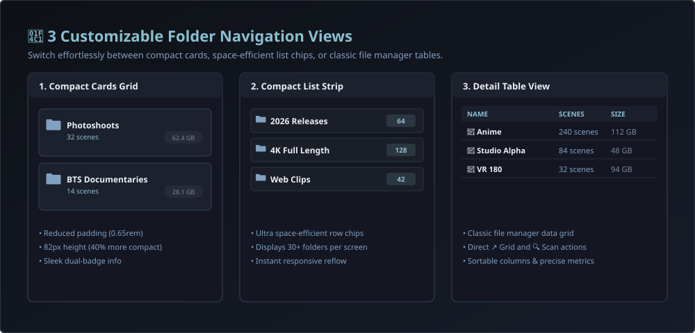
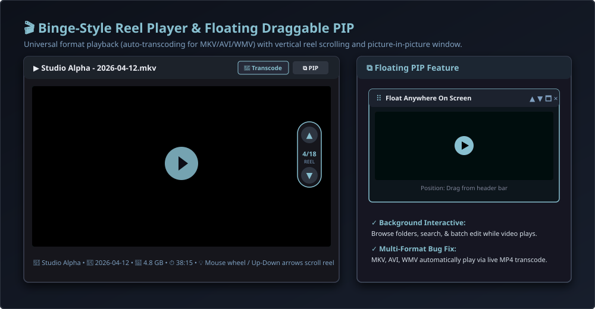

# Stash Path File Manager


A high-performance, path-based directory navigation plugin for [Stash](https://github.com/stashapp/stash), featuring customizable folder views, Binge-style directory reel playback, a floating draggable Picture-in-Picture (PIP) player, and live regex filename metadata parsing.

---

## 📸 Feature Showcase

### 1. 📁 3 Customizable Folder Navigation Views


Eliminate wasted vertical space with compact folder layouts tailored to any library structure:
* **田 Cards Grid:** Sleek, compact tiles showing the folder icon, folder name, scene count badge, and formatted file size. Reduced padding and a minimum height of 82px display significantly more items per row.
* **☰ Compact List:** Ultra space-efficient horizontal folder chips showing the icon, bold name, and item count. Ideal for browsing 30+ directories on a single screen without endless scrolling.
* **☷ Detail Table:** Classic file manager data table with sortable columns for **Name**, **Type**, **Scenes**, **Size**, and quick actions (**↗ Grid** to open in Stash's native scene grid, and **🔍 Scan** to trigger a filesystem metadata scan).
* **View Persistence:** Your selected view preference is saved automatically in `localStorage` across sessions.

---

### 2. 🎬 Multi-Format Video Player & Binge-Style Reel Navigation


* **Multi-Format Playback & Stream Selection:** Direct stream integration with Stash API key authentication, automatic error fallback to live transcode (MP4/WebM/HLS), custom stream profile selector, and instant Stash Player link for unsupported proprietary codecs.
* **Automatic Error Recovery:** If direct streaming fails in your browser, the player automatically falls back to live transcoding without interrupting your session.
* **Stream Switcher:** Toggle between `⚡ Direct Stream` and `🔄 Transcode (MP4)` on demand.
* **📱 Binge-Style Directory Reel:**
  * **Mouse Wheel Navigation:** Scroll down to advance to the next video; scroll up to return to the previous video (with debounce protection).
  * **Keyboard Shortcuts:** `↓` / `PageDown` / `J` (Next), `↑` / `PageUp` / `K` (Previous), `Space` (Play/Pause), `←` / `→` (±10s seek), `M` (Mute), `Escape` (Close).
  * **Touch Swipe:** Swipe up and down on mobile or tablet touch screens.
  * **On-Screen Chevrons:** Floating navigation pill with `▲ Prev` and `▼ Next` buttons, folder position counter (`Scene 3 of 12`), and tooltip titles.

---

### 3. ⧉ Draggable Floating Picture-in-Picture (PIP) Window
* **Float Anywhere:** Click the `⧉ Float PIP` button to pop the video out into a floating mini-player.
* **Draggable Header:** Grab the drag handle (`⠿`) to move the window anywhere across the screen.
* **Full Background Interactivity:** Continue navigating directories, searching files, and batch editing while the video plays uninterrupted.
* **In-PIP Controls:** Quick buttons for previous/next scene (`▲` / `▼`), stream switcher, restore to modal (`🗖`), and close (`×`). Video playback timestamp is preserved across modal and PIP transitions.

---

### 4. 🧭 Browser History & Folder Location Retention (QoL Improvements)
* **In-App & Browser History Navigation:** Dedicated **◀ Back** and **▲ Up** toolbar buttons for instant folder navigation without page reload; seamless browser Back/Forward synchronization with zero history corruption or stuck pages.
* **Browser Back / Forward Support:** Hitting your browser's Back button ("previous page") steps back to the parent folder instead of abruptly closing the file manager. The workspace only closes when navigating back past the root directory.
* **Persistent Folder Memory:** Remembers your last visited directory in `localStorage`. Clicking the "Files" navbar button or returning from Stash reloads your exact folder level without requiring re-navigation.
* **Native Grid Launcher:** The `↗ Grid` button opens the Stash native scene card grid in a new tab, keeping your file browser location open and intact.

---

### 5. ⚡ In-Memory Trie Cache & Regex Tools
* **Progressive Indexing & Caching:** Caches the parsed directory hierarchy in `sessionStorage` and IndexedDB for instant reloads.
* **Folder-Scoped Filename Regex Parser:** Test regular expression pattern schemes scoped strictly to the current folder with live interactive match preview tables.
* **Batch Operations:** Auto-detect matching Studios and Performers from folder names and apply batch updates.

---


---

## 📋 Changelog & Development History

### [v2.5.2] — 2026-09-23 13:28:00
* **Fixed Right Action Buttons Clipping:** Resolved an issue where buttons above the Previous Video button (Close, Stash, VLC, Copy Link, Transcode) were cut off and invisible. Removed a legacy conflicting CSS rule that inadvertently applied `transform: translateY(-50%)` to `top: 18px`, pushing the top half of the button column out of the container. Consolidated to a clean `transform: none; top: 18px; right: 18px;` rule ensuring the complete button stack is fully visible.

### [v2.5.1] — 2026-09-23 13:20:00
* **Fixed Stash Plugin Manifest Schema Error:** Removed extraneous `id:` field from `stash_file_manager.yml`. In Stash, `plugin.Config` uses `name:` in the plugin manifest (with the plugin ID derived from the directory name), resolving the YAML unmarshal error `field id not found in type plugin.Config` during package update and plugin reload.

### [v2.5.0] — 2026-09-23 12:15:00
* **MPEG-4 (.mp4) vs H.264 (.mp4) Smart Codec Detection:** Added codec-level inspection querying `video_codec`. MPEG-4 Part 2 / ASP (`mpeg4`, `mp4v`, `divx`, `xvid`) in `.mp4` containers automatically defaults to HLS transcode (as browsers cannot decode MPEG-4 natively), while `h264.mp4` streams directly. Runtime decoder errors also instantly auto-fallback to HLS.
* **Unified 36px Circular Buttons & Alignment:** Resized all circular buttons to `36px` to match the close button, aligned them vertically along `right: 18px`, starting from the close button at the top.
* **Increased Spacer Dividers:** Enlarged the divider gaps above and below the Prev/Counter/Next navigation cluster for cleaner visual separation.
* **TikTok-Style Scroll Threshold:** Re-engineered up/down scrolling with a true 50% threshold. Pulling less than half the screen height snaps the video smoothly back to center; only pulling over half transitions to the adjacent video.
* **Elevated Metadata Description Overlay:** Moved the file name, format badge, and file size/duration block up (`bottom: 84px`), preventing any overlap with the timeline scrubbing bar.
* **PiP Redesign — Zero Lingering Player with Seamless Enlarge:** Switching to PiP now completely dismisses the player modal dialog and backdrop so users can browse Stash with no lingering placeholder card. The `<video>` DOM node stays alive in the background; clicking either the floating return pill or the native PiP window's "Enlarge" button seamlessly restores the full player modal.
* **Synchronized Native Stash Plugin Settings:** Fixed the GraphQL mutation argument from `values` to `input: $input` and added explicit `id: stash_file_manager` in manifest. In-app settings now seamlessly write to and read from Stash's native `config.yml` (`configuration.plugins.stash_file_manager`).

### [v2.4.0] — 2026-09-23 10:45:00
* **Fixed Picture-in-Picture (PiP) Implementation:** Resolved broken PiP where an invisible video played in the background. The primary video element is now kept persistently mounted in the DOM, preventing browser PiP session decoupling and background audio desync.
* **Unified Right-Side Circular Action Bar:** Moved all player function buttons from the top bar into sleek, circular buttons aligned vertically on the right, ordered exactly as: `[Stash ↗] > [VLC 🚀] > [Copy Link 📋] > [Transcode Dropdown ⚡/📺/🔄] > [space] > [Prev ▲] > [Counter 1/15] > [Next ▼] > [space] > [PiP ⧉] > [Fullscreen ⛶]`.
* **TikTok / Instagram-Style Auto-Hiding Metadata Overlay:** Relocated file name, format badge, and studio pill to the bottom-left overlay, with duration, file size, date, and video codec directly beneath. All metadata, controls, and action buttons auto-hide together after 2.5 seconds of user inactivity.
* **Full-Bleed Canvas & Removed Bars:** Completely eliminated the static top and bottom bars, transforming the player into an edge-to-edge video canvas.
* **Consistent Custom Player UI (Eliminated Browser Control Morphing):** Implemented custom dark timeline scrubber, play/pause button, time counter, and volume slider. Disabled browser native controls heuristics, stopping Chrome from switching between white rounded pills and black bars across different codecs.
* **Optimized Transcode Default & Fallback Logic:** Native videos (`mp4`, `m4v`, `webm`) stream `direct` by default. Non-native videos (`.avi`, `.flv`, `.wmv`, `.mpg`) automatically fall back to `hls` (instead of webm). Added `fallback_transcode_method` to Stash Plugin Settings.
* **Fixed Sticky Transcode Bug on Reel Scroll:** Stream mode now re-evaluates per-scene during scrolling, ensuring native MP4 files immediately resume Direct stream even after scrolling past non-native videos.
* **Seamless Video Reel Scrolling:** Re-engineered up/down scrolling with a continuous vertical reel track that pre-renders adjacent top and bottom video slides with poster screenshots, creating fluid, connected video-reel scrolling.

### [v2.3.0] — 2026-09-23 09:12:00
* **Fixed Plugin Manifest YAML Schema:** Resolved Stash plugin loader unmarshal errors (`field date not found in type plugin.Config` and `cannot unmarshal !!str into []string`) by removing the extraneous `date` key from `stash_file_manager.yml` (reserved exclusively for `index.yml`) and declaring `ui.javascript` and `ui.css` as YAML string arrays.
* **Native Stash Plugin Settings (`Settings → Plugins → Path File Manager`):** Added a full settings schema exposed directly in Stash's native UI:
  * `default_transcode_method`: Configurable default playback stream mode (`direct` raw stream, `webm` progressive transcode, or `hls` adaptive stream).
  * `root_library_path`: Custom library root folder path override.
  * `folder_view_mode` & `scene_view_mode`: Default layout modes (`cards`, `list`, `details` / `cards`, `table`).
  * `folder_card_size` & `scene_card_size`: Default zoom slider values.
  * `default_sort_field` & `default_sort_direction`: Default scene sorting criteria and order.
  * `remember_last_path`: Toggle to resume at the last visited folder across sessions.
  * `auto_rebuild_tree_on_start`: Toggle to automatically rebuild the directory tree on plugin load.
* **Native Stash Plugin Tasks (`Settings → Tasks → Plugin Tasks`):** Introduced `sfm_tasks.py` backend runner implementing standard Stash task operations:
  * `Rescan Library and Rebuild Tree`: Crawls library directories, counts scenes, and rebuilds local directory cache.
  * `Reset Plugin Settings to Defaults`: Restores factory default settings via Stash's `configurePlugin` GraphQL mutation and clears caches for troubleshooting.
  * `Initialize Plugin Configuration`: Verifies library paths and seeds configuration into Stash.
* **In-App Settings & Tasks Dialog:** Added a `⚙️ Settings` button to the File Manager toolbar that opens a settings modal allowing users to inspect active settings, save changes directly to Stash's `config.yml`, trigger tree rebuilds, and access Stash Settings pages.

### [v2.2.0] — 2026-09-23 08:17:48
* **Unified Section Headers:** Relocated the Scene view toggle (`⊞ Cards` / `☰ Table`) from the top toolbar to the `Files / Scenes` section header line, creating visual and behavioral uniformity with the `Subfolders` section controls.
* **Relocated Select All Control:** Moved the `Select All` / `Deselect All` button directly alongside the scene count and selection badge.
* **Dynamic Card Size Sliders:** Added smooth thumbnail size zoom sliders for both **Folder Cards** (120px–300px) and **Scene Cards** (160px–420px), utilizing responsive CSS Grid containers (`grid-template-columns: repeat(auto-fill, minmax(...))`) with `localStorage` persistence.
* **Cleaned Top Toolbar:** Streamlined the top bar to focus purely on search query filtering and folder/scene sorting.

### [v2.1.1] — 2026-09-23 07:52:04
* **Transcode Delivery Architecture Re-evaluation:** Decoupled segmented streaming protocols (**HLS**) from progressive container transcodes (**WebM** / **MP4**).
* **Native & MSE HLS Engine:** Added client-side detection for native WebKit HLS and Media Source Extensions (MSE via `hls.js`), with automated graceful fallback to progressive WebM containers when MSE is unavailable.
* **API Key Preservation:** Explicitly carried query parameters (`?apikey=...`) across all transcode and direct stream requests for authenticated Stash instances.

### [v2.1.0] — 2026-09-23 07:31:13
* **Redesigned Clean Player UI:** Eliminated redundant duplicate buttons (multiple PiP triggers, repeated VLC links, duplicate link buttons) into a single, cohesive header toolbar.
* **Double-Click Seek Fix:** Resolved native browser fullscreen interception on double-click by attaching gesture handlers with `e.preventDefault()`, restoring reliable left/right 10s seek.
* **Binge-Style Scroll Pull Threshold:** Replaced instantaneous wheel triggers with an accumulated drag/pull delta (140px threshold) with spring-back easing and directional destination pill previews.
* **Semantic Version Tagging:** Added version identifiers to all release commits and index manifests.

### [v2.0.4] — 2026-09-23 03:25:46
* **Navbar Line-Wrap Fix:** Fixed button injection in `PluginApi.patch.instead("MainNavBar.MenuItems")` by inserting directly into `.row` children rather than creating a block-level sibling outside the flex row.

### [v2.0.3] — 2026-09-23 01:45:00
* **Stash Package Installer Integration:** Switched distribution packaging to zip archives with SHA256 checksums in `index.yml`.

### [v2.0.2] — 2026-09-22 22:30:00
* **Collapsible Sections:** Added interactive chevron toggle controls to expand and collapse `Subfolders` and `Files / Scenes`.
* **Stability:** Wrapped components in React Error Boundaries to prevent rendering crashes.

### [v2.0.1] — 2026-09-22 18:15:00
* **In-App History Navigation:** Added dedicated **◀ Back** and **▲ Up** toolbar buttons with browser history synchronization.
* **Stream Authentication:** Resolved playback failures on secure Stash instances by resolving authenticated stream paths.

### [v2.0.0] — 2026-09-22 12:00:00
* **Customizable Folder Views:** Introduced 3 folder views: Compact Cards, Horizontal List Strip, and Detail Table with direct Stash Grid and Scan triggers.
* **Binge-Style Directory Reel:** Vertical reel navigation through folder contents using mouse wheel, touch swipe, and keyboard shortcuts.
* **Draggable Floating PIP:** Mini-player window draggable anywhere across the screen while keeping folder browsing interactive.

### [v1.1.1] — 2026-09-21 16:40:00
* **PluginApi.patch Integration:** Adopted Stash's native UI plugin patching mechanism for responsive navbar integration.

### [v1.1.0] — 2026-09-21 11:20:00
* **Multi-Selection & Batch Actions:** Added scene multi-selection with floating bulk action bar and detailed table view.

### [v1.0.2] — 2026-09-21 08:30:00
* **Navbar Peer Injection:** Ensured the navigation bar item is inserted as a true peer in the navbar container.

### [v1.0.1] — 2026-09-20 20:15:00
* **UI Polish:** Refined navigation bar button styling and workspace theme aesthetics.

### [v1.0.0] — 2026-09-20 14:00:00
* **Initial Release:** Hierarchical directory navigation using client-side in-memory trie caching, session storage persistence, and regex filename parsing.

---

## 🗺️ Roadmap & Future Architecture

### 📍 Phase 1: Core Navigation & Player Foundation (Complete)
- [x] Hierarchical path trie indexing and client-side session caching.
- [x] Multi-selection with floating batch action bar and detail table view.
- [x] Compact customizable folder views (Cards, List, Detail Table).
- [x] Binge-style directory reel player with pull threshold & floating draggable PiP.
- [x] Protocol-aware transcode delivery hierarchy (Direct Play, HLS Segmented, WebM Container).
- [x] Dynamic thumbnail card size zoom sliders with local storage persistence.

### 📍 Phase 2: Native View Integration (Current Architectural Focus)
- [ ] **Transition from Overlay Layer to Native Routed View:** Re-architecting the workspace from a `position: fixed` overlay layer into an integrated page view mounted inside Stash's native main container (`/scenes?view=folder` or `/plugin/file-manager`).
- [ ] **Native Navigation Bar & Settings Retention:** Retaining Stash's top navigation bar, global search, background task queue spinners, and user settings dropdown at all times during folder browsing.
- [ ] **Theme Parity:** Seamless automatic glass and accent adaptation with community themes (e.g., Refract, Dark, Nord).

### 📍 Phase 3: Advanced Folder Metadata & Media Management (Planned)
- [ ] **Folder Poster Art & Custom Covers:** Ability to select any scene poster or image as a persistent folder thumbnail cover.
- [ ] **In-Folder Filter Parity:** Filtering items inside a specific folder by Performer, Tag, Studio, or Rating without leaving the directory hierarchy.
- [ ] **Directory Playlist Queue:** One-click queueing of entire directory trees into Stash's native playback queue or MultiView.

## 📦 Installation

### Method 1: Via Stash Plugin Source (Recommended Community Method)

Install directly through Stash's built-in plugin manager to receive one-click updates:

1. In Stash, go to **Settings → Plugins**.
2. Scroll to the **Available Plugins** section and click **Add Source**.
3. Fill out the popup:
   - **Name:** `Stash Plugins`
   - **Source URL:** `https://raw.githubusercontent.com/daailouivan/stash-plugins/main/index.yml`
4. Click **Confirm / Add**.
5. Under **Available Plugins**, locate **"Path File Manager"** and click **Install**.
6. Go to the **Plugins** section and click **Reload Plugins**.

---

### Method 2: Via Git Clone (Terminal / CLI)

Clone the repository directly into your Stash `plugins` directory:

**Linux / macOS / Docker:**
```bash
cd ~/.stash/plugins
git clone https://github.com/daailouivan/stash-plugins.git stash_file_manager
```

**Windows (PowerShell):**
```powershell
cd $env:USERPROFILE\.stash\plugins
git clone https://github.com/daailouivan/stash-plugins.git stash_file_manager
```

After cloning, go to **Settings → Plugins** in Stash and click **Reload Plugins**.

---

### Method 3: Manual Download

1. Download the latest `stash_file_manager.zip` from the Releases page.
2. Extract the `stash_file_manager` folder into your Stash plugins folder:
   - **Windows:** `%USERPROFILE%\.stash\plugins\stash_file_manager\`
   - **Linux / Docker:** `~/.stash/plugins/stash_file_manager/`
3. In Stash, go to **Settings → Plugins** and click **Reload Plugins**.

---

## 🚀 How to Access

* Click the native **"Files"** button in Stash's main navigation bar.
* Or browse directly to `http://localhost:9999/#file-manager`.
